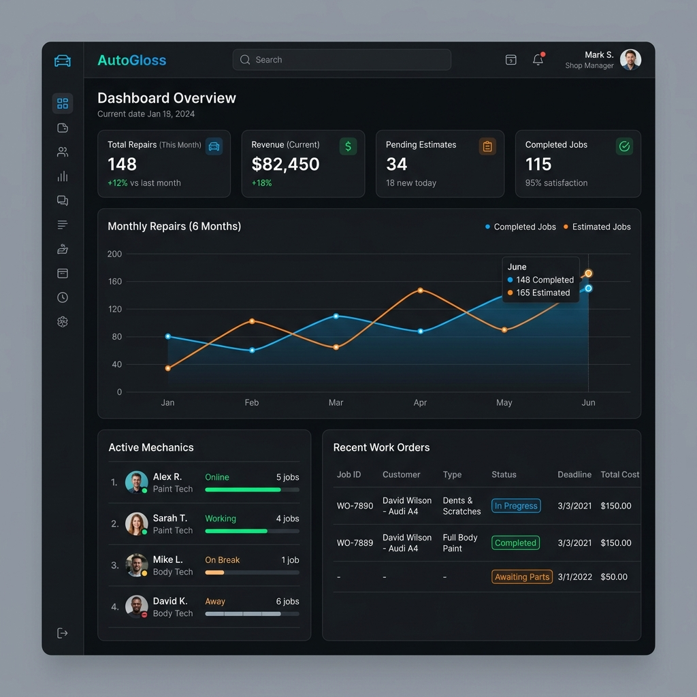
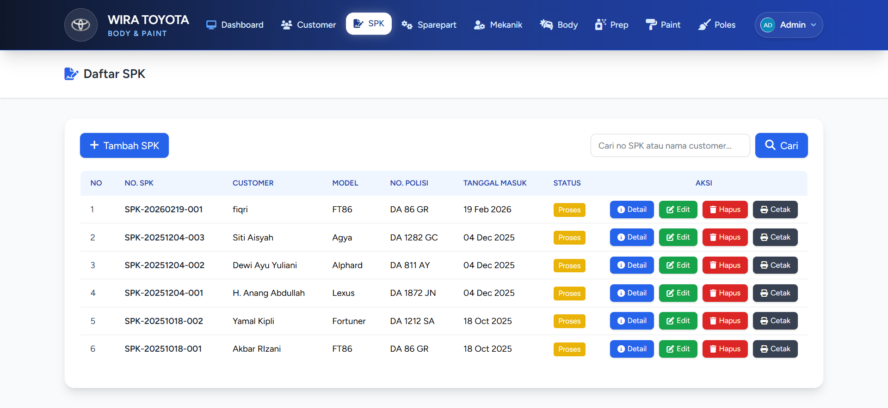
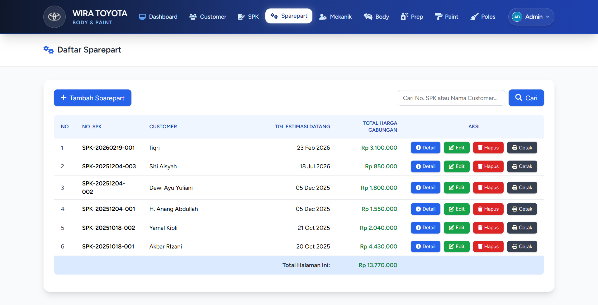
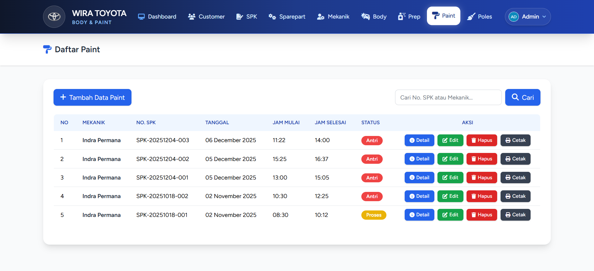

# 🚗 BP Toyota - Body & Paint Management System

[](https://laravel.com)
[](https://tailwindcss.com/)
[](https://alpinejs.dev/)

> Sistem Informasi Manajemen Body & Paint untuk bengkel Toyota. Proyek ini dibangun sebagai bagian dari Praktik Kerja Lapangan (PKL) untuk mendigitalisasi proses kerja dari SPK, Sparepart, hingga tahapan perbaikan bodi mobil secara terstruktur mulai dari Mekanik, Body, Preparation, Paint, hingga Poles.

---

## ✨ Fitur Utama

- **Manajemen Pelanggan & SPK**: Pendataan pelanggan dan pembuatan Surat Perintah Kerja (SPK).
- **Inventaris Sparepart**: Pemantauan stok dan pemakaian suku cadang.
- **Tracking Tahapan Perbaikan**:
  - 👨‍🔧 **Mekanik**: Pengecekan awal dan perbaikan mesin/kaki-kaki.
  - 🔨 **Body**: Proses perbaikan bodi (ketok, las, dll).
  - 🛠️ **Preparation**: Persiapan sebelum pengecatan (dempul, amplas, epoxy).
  - 🎨 **Paint**: Proses pengecatan kendaraan di oven.
  - ✨ **Poles**: Proses pemolesan dan finishing kendaraan sebelum penyerahan.
- **Reporting System**: Generate laporan untuk setiap tahapan (SPK, Mekanik, Body, Paint, dll).
- **Dashboard Interaktif**: Ringkasan data (analytics) secara real-time.

---

## 📸 Screenshots

Berikut adalah beberapa tampilan dari aplikasi BP Toyota:

### 1. Halaman Dashboard


### 2. Manajemen Surat Perintah Kerja (SPK)


### 3. Inventaris Sparepart


### 4. Laporan Progress Pengecatan (Paint)


---

## 🚀 Cara Instalasi & Menjalankan (Local Development)

Ikuti langkah-langkah berikut untuk menjalankan proyek ini di komputer lokal Anda:

1. **Clone repository ini**
   ```bash
   git clone https://github.com/fiqrianwar1/pkl-bp-toyota.git
   cd pkl-bp-toyota
   ```

2. **Install dependency PHP & Node.js**
   ```bash
   composer install
   npm install
   ```

3. **Salin file environment & generate App Key**
   ```bash
   cp .env.example .env
   php artisan key:generate
   ```

4. **Konfigurasi Database**
   Buka file `.env` dan sesuaikan koneksi database Anda:
   ```env
   DB_CONNECTION=mysql
   DB_HOST=127.0.0.1
   DB_PORT=3306
   DB_DATABASE=bp_toyota
   DB_USERNAME=root
   DB_PASSWORD=
   ```
   *(Pastikan Anda sudah membuat database bernama `bp_toyota` di phpMyAdmin / MySQL)*

5. **Jalankan Migrasi Database**
   ```bash
   php artisan migrate
   ```

6. **Jalankan server**
   ```bash
   npm run dev
   # Buka terminal baru dan jalankan:
   php artisan serve
   ```

7. **Akses Aplikasi**
   Buka browser dan kunjungi `http://localhost:8000`

---

## 👨‍💻 Author

- **Fiqri Anwar** - *Mahasiswa PKL* - [GitHub Profile](https://github.com/fiqrianwar1)

---

## 💻 Teknologi Yang Digunakan

<div align="center">
  
  
  
  
  
  
  
  
</div>

<br>

- **Backend**: Laravel 11 (PHP 8.2)
- **Frontend UI**: Tailwind CSS v3, Alpine.js, Blade Components
- **Database**: MySQL 8
- **Charts**: Chart.js
- **Exports**: Laravel DomPDF, Laravel Excel
- **DevTools**: Laravel Pint, Playwright E2E

---

<div align="center">
  Dibuat dengan ❤️ untuk kemudahan operasional bengkel.<br>
  <strong>Wira Toyota &copy; 2026</strong>
</div>
